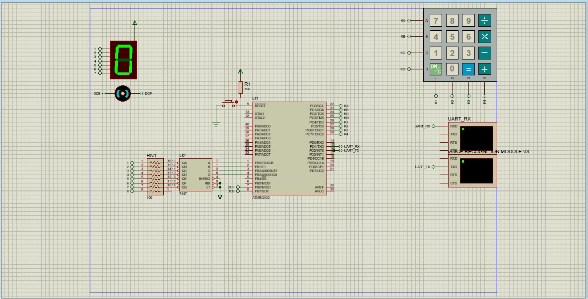
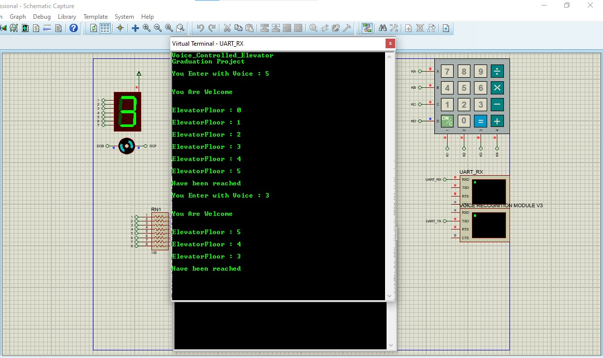
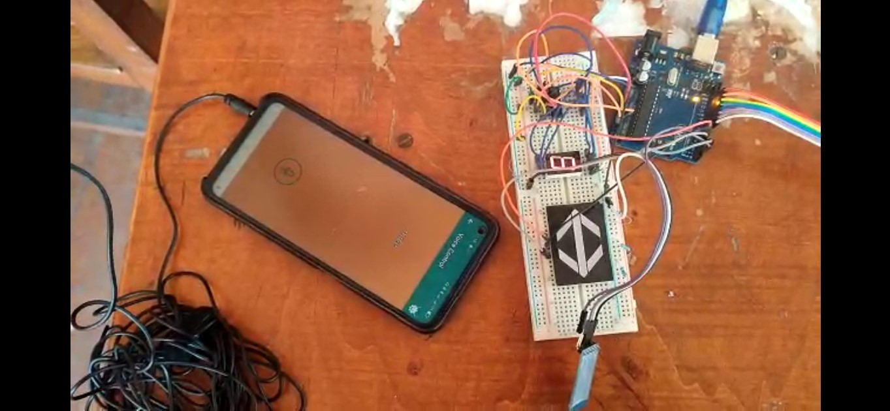

# Elevator Voice Control System
## Graduation project from the Faculty of Engineering, Alexandria University

# Elevator Voice Control System With ATmega32

### Description
    After the Coronavirus swept the world and infected many, many people and died from this virus 
    around the world, it was more important to think of ways to avoid the virus and limit its spread, 
    and one of the reasons for its spread was the use of elevators and what was happening inside 
    elevators from patients trying to Spreading the disease to infect others, so it was necessary
    to have an alternative to using the elevator without pressing the control buttons, so a lot of
    people moved to change the control panel from controlling using buttons and touch to 
    controlling by voice

#### Software
- ATmega 
([Code](./Voice_Controlled_Elevator_with_Atmega32/GccApplication1/GccApplication1))  ([Video](https://drive.google.com/file/d/1pDFWJa4fmocL0kSVUzYNoXRXiSIBUsot/view?usp=sharing))
- Arduino
([Code](./Elevator_Voice_Control_System_with_Arduino/Elevator_Voice_Control_System.ino))  ([Video](https://drive.google.com/file/d/1uxXVeBpGNxIKDnRkVT1cfsh58tJjX1Al/view?usp=sharing))

#### Hardware
	- Microcontroller ( ATmega32 and Arduino )
	- Voice Recognition Module v3
	- Bluetooth Module HC-05 
	- 7447 with 7 segment display
	- Keypad
	- Arrow LED Display or DC Motor
### Proteus
 
 
	
	
### Videos

	
	

